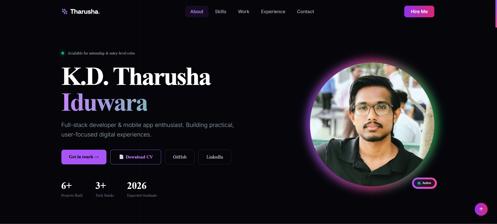

# K.D. Tharusha Iduwara — Portfolio
> Personal portfolio website built with React, Vite, and Tailwind CSS.

**Live at:** [Portfolio](https://portfolio-tawny-psi-48.vercel.app) · [GitHub](https://github.com/tharushainduwara) · [LinkedIn](https://linkedin.com/in/tharusha-iduwara)

---

## Screenshot



---

## About

A responsive, single-page portfolio showcasing my projects, skills, and background as a full-stack and mobile developer. Built with a dark aesthetic, subtle animations, and clean typography using the Inter and Syne font families.

Final-year BSc undergraduate in Management & Information Technology at South Eastern University of Sri Lanka — actively seeking internship and entry-level opportunities in web and mobile development.

---

## Features

- **Multi-section layout** — Home, Skills, Projects, Experience, and Contact
- **Project filtering** — browse by Web, Mobile, or Desktop category
- **Featured project highlights** — pinned cards with hover effects and gradient accents
- **Responsive design** — works across desktop and mobile
- **Smooth animations** — fade-in, slide-up, and float keyframe animations via Tailwind
- **Copy-to-clipboard** — one-click email copy in the Contact section

---

## Tech Stack

| Layer | Technology |
|---|---|
| Framework | React 18 + Vite |
| Styling | Tailwind CSS |
| Icons | Lucide React |
| Fonts | Inter, Syne, Space Mono, Space Grotesk |
| Deployment | _(e.g. Vercel / Netlify — update as needed)_ |

---

## Project Structure

```
src/
├── pages/
│   ├── Home.jsx        # Hero section with intro and stats
│   ├── About.jsx       # Skill categories grid
│   ├── Projects.jsx    # Portfolio with filter tabs
│   ├── Resume.jsx      # Certifications, leadership, tools
│   └── Contact.jsx     # Contact info and references
├── main.jsx
index.html
tailwind.config.js
```

---

## Getting Started

```bash
# Clone the repository
git clone https://github.com/tharushainduwara/portfolio.git
cd portfolio

# Install dependencies
npm install

# Start development server
npm run dev

# Build for production
npm run build
```

Requires Node.js 18+.

---

## Projects Showcased

| Project | Category | Stack |
|---|---|---|
| Beauty Shop | Web | React, Node.js, MongoDB, Express, JWT |
| MovieFlix | Web | PHP, MySQL, JavaScript, Tailwind |
| CoffeeStore | Desktop | C#, .NET, SQL Server, WinForms |
| Student Details | Desktop | C#, .NET, SQL Server, WinForms |
| Cocktail Recipes | Mobile | Flutter, Dart, REST API |
| Note Handler | Mobile | Flutter, Dart, REST API, Provider |

---

## Contact

- **Email:** tharushaiduwara1234@gmail.com
- **Phone:** +94 705 321 114
- **Location:** Wadduwa, Sri Lanka

---

## License

This project is open source and available under the [MIT License](LICENSE).
